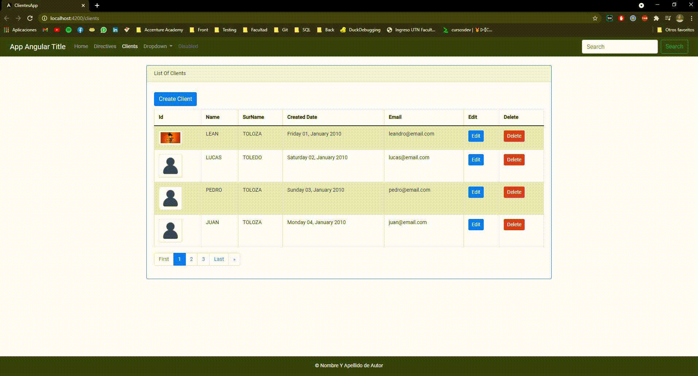

#App-Template

### Contributor: Leandro Toloza

## Description:

### APP-TEMPLATE it's a free to use template for profiles created with SpringBoot + Angular. 

## Features:

  - Simple CRUD for Profiles
  - Validations (Front-End // Back-End)
  - Upload Photos
  - Modals
  - Figure Rotation
 
## Instructions

  - Clone Repository
  - Configure Your Database (Application.properties on SpringBoot)
  - Open SpringBoot Backend Apirest
  - Run SpringBootApp
  - Open App-Template/Angular
  - Run ng serve -o

